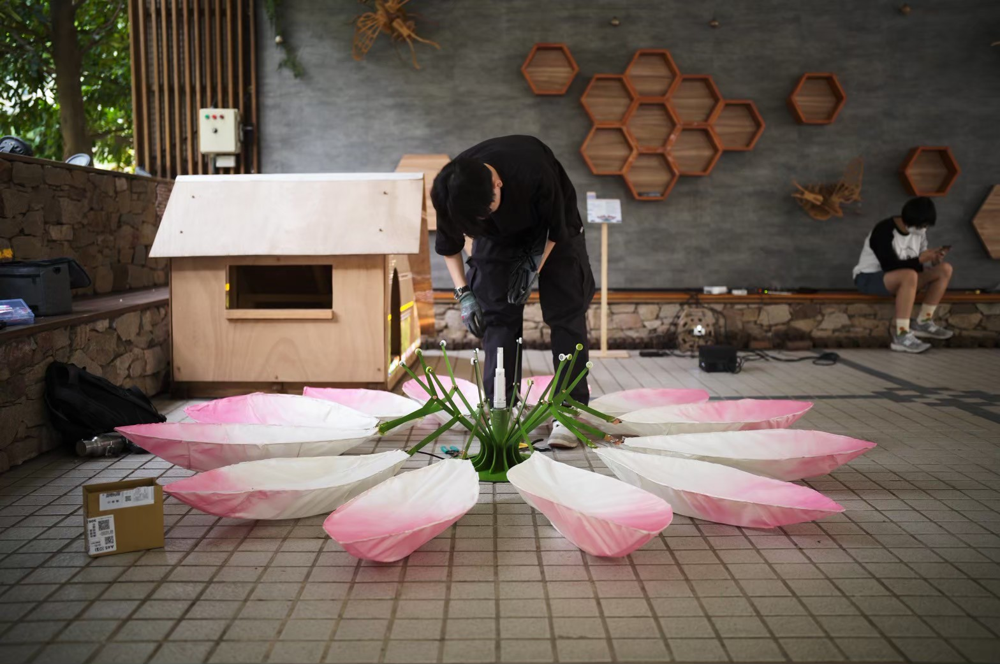
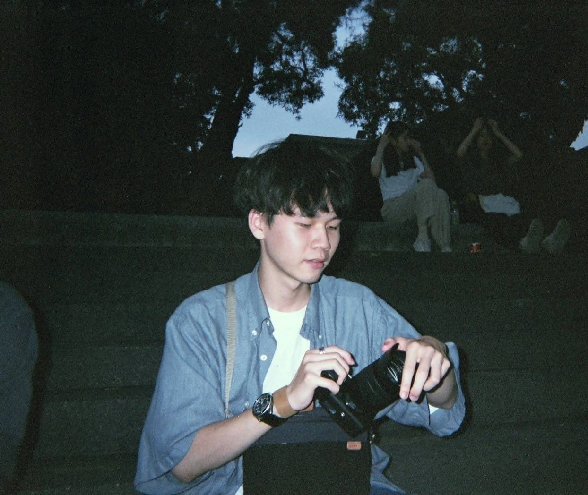

## 動態影像後期製作
- 沙畫機器人展示影片 [影片連結](https://youtu.be/ChdDfuRjPjM)
- 臺科50週年校慶限定三部曲 [影片連結](https://youtube.com/playlist?list=PLBd9stDq-VXFkVkL51lzicIR4EGIWdpJL&si=GdkEcCUKqoJJCRF-)
- 臺科2025年畢業典禮組曲ＭＶ影片製作 [影片連結](https://youtu.be/unhAOp45DTk?si=Ig3aRLRccO-BucPy)

## 聲音後製混音工程
- Covers [Youtube連結](https://www.youtube.com/playlist?list=PLMfWvSiXHSw09PV08rU-XV47XvmzxLIFR)

## 燈光音響工程
經歷： 創立台科燈光音響組，從創立至今已負責協力超過30場音樂性表演，其中像是台科草地音樂節、園遊會，以及本校的搖滾實驗室（熱音社）、吉他社、熱舞社與各系會等等。
> 說明：目前關於這塊可能只有一張的照片可以放而已，因為去工作通常都沒有什麼影像被記錄到

## 平面攝影紀錄
- IG帳號 [IG](https://www.instagram.com/_haohao_2003__/)

## 特殊經歷
- 參與「藝術跨域創作課程」（蓮花開小組）[相關影片](https://youtu.be/qS2mb7FrwwQ?si=4qhuetaoXmM10zWU)

## 關於我自己的資料：
### 小簡介
我是一個喜歡拍照、喜歡音樂也同時喜歡動手做的人，也因為如此讓我對於各方面的事物都有很大的熱忱，從平面、動態攝影、後期影像製作、混音工程，又甚至是現場的音響工程，對我來說都很有興趣，所以決定在這個網站上面放上自己的經歷作為紀錄。

### 學生組織幹部經歷
- 111級臺科絃韻吉他社社長
- 第18屆學生會副會長

### 活動籌備經歷
- 第26屆全國大專院校台科金絃獎 總召
- 2024 臺科校園演場會 副召
- 台科50週年校慶園遊會 總召

### 學歷
- 學士：國立臺灣科技大學 機械工程系
- 碩士：國立臺灣科技大學 機械工程系控制組（在學中）

### 聯絡方式
- email: haohaoliu0725@gmail.com
